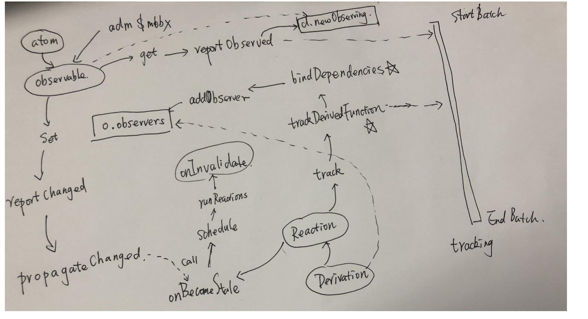

# Mobx 原理解析

## autorun


### 源码文章
* [mobx auto 源码解析](https://segmentfault.com/a/1190000013682735)

## bindDependencies 更新依赖 <font style='color:red'>重要</font>
### 借助diffValue，将新旧 observing数组比较算法的复杂度（原朴素算法 时间复杂度为 O(n^2)）降低 O(n)
```
function bindDependencies(derivation: IDerivation) {
  const prevObserving = derivation.observing
  const observing = (derivation.observing = derivation.newObserving!)
  // 记录更新依赖过程中，新观察的 Derivation 的最新状态
  let lowestNewObservingDerivationState = IDerivationState.UP_TO_DATE

  // 遍历新的 observing 数组，使用 diffValue 这个属性来辅助 diff 过程：
  // 所有 Observable 的 diffValue 初值都是0（要么刚被创建，继承自 BaseAtom 的初值0；
  // 要么经过上次的 bindDependencies 后，置为了0）
  // 如果 diffValue 为0，保留该 Observable，并将 diffValue 置为1
  // 如果 diffValue 为1，说明是重复的依赖，无视掉
  let i0 = 0,
    l = derivation.unboundDepsCount
  for (let i = 0; i < l; i++) {
    const dep = observing[i]
    if (dep.diffValue === 0) {
      dep.diffValue = 1
      // i0 不等于 i，即前面有重复的 dep 被无视，依次往前移覆盖
      // derivation.newObserving : [A, B, A, B, C] 初始值diffValue 都为0, A 引用是同一个
      // 遍历到第一个B时， diffValue: [1,1,1,1, 0], 此时 i0 = 2, 判断dep.diffValue = 0,即到C， 故 i0 =2, i = 3, 直接将C移动到数组索引=2的位置，即覆盖了之前重复的项
      if (i0 !== i) observing[i0] = dep
      i0++
    }

    // 更新 lowestNewObservingDerivationState
    if (((dep as any) as IDerivation).dependenciesState > lowestNewObservingDerivationState) {
      lowestNewObservingDerivationState = ((dep as any) as IDerivation).dependenciesState
    }
  }
  observing.length = i0

    derivation.newObserving = null
  // 遍历 prevObserving 数组，检查 diffValue：(经过上一次的 bindDependencies后，该数组中不会有重复)
  // 如果为0，说明没有在 newObserving 中出现，调用 removeObserver 将 dep 和 derivation 间的联系移除
  // 如果为1，依然被观察，将 diffValue 置为0（在下面的循环有用处）
  l = prevObserving.length
  while (l--) {
    const dep = prevObserving[l]
    if (dep.diffValue === 0) {
      removeObserver(dep, derivation)
    }
    dep.diffValue = 0
  }

  // 再次遍历新的 observing 数组，检查 diffValue
  // 如果为0，说明是在上面的循环中置为了0，即是本来就被观察的依赖，什么都不做
  // 如果为1，说明是新增的依赖，调用 addObserver 新增依赖，并将 diffValue 置为0，为下一次 bindDependencies 做准备
  while (i0--) {
    const dep = observing[i0]
    if (dep.diffValue === 1) {
      dep.diffValue = 0
      addObserver(dep, derivation)
    }
  }

  // 某些新观察的 Derivation 可能在依赖更新过程中过期
  // 避免这些 Derivation 没有机会传播过期的信息（#916）
  if (lowestNewObservingDerivationState !== IDerivationState.UP_TO_DATE) {
    derivation.dependenciesState = lowestNewObservingDerivationState
    derivation.onBecomeStale()
  }
}
```