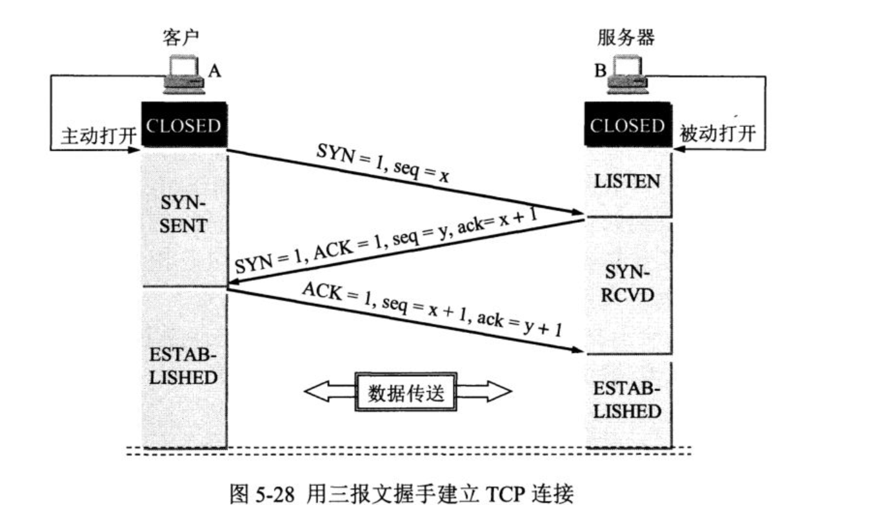
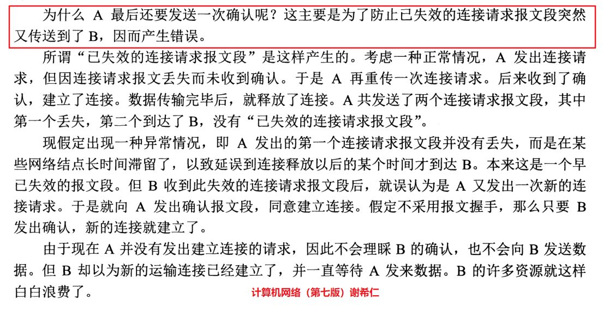
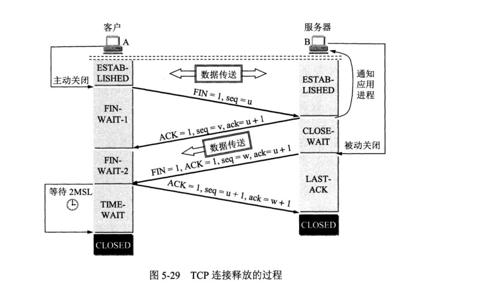

# 面试积累
* [基础](#基础)
* [CSS和移动端](#CSS和移动端)
* [浏览器Event Loop](#浏览器EventLoop)
* [http](#http)
  * [http1.1 和 http2.0](#http1.1和http2.0)
  * [三次握手原因](#三次握手原因)
  * [四位挥手](#四位挥手)
  * [keep-alive](#keep-alive)
* [Vue](#Vue)
  * [vue框架是如何检测数组变化的？](#vue框架是如何检测数组变化的？)
  * [vue双向绑定如何实现的？](#vue双向绑定如何实现的？)
  * [vueEventBus的$once实现？](#vueEventBus的$once实现？)
* [ES6](#ES6)
  * [Promsie实现](#Promsie实现)
  * [Promise.race实现](#Promise.race实现)
  * [Promise.finally实现](#Promise.finally实现)
* [跨域](#跨域)
* [缓存](#缓存)
* [安全](#安全)
* [nginx](#nginx)
* [webpack babel](#webpack)
* [node](#node)
## 基础
* html5 语义标签
  * 语义标签: header、article、nav、main、section、footer
  * Video ： play() 和 pause()
    支持格式：MP4, WebM, 和 Ogg
    * MP4 = 带有 H.264 视频编码和 AAC 音频编码的 MPEG 4 文件
    * WebM = 带有 VP8 视频编码和 Vorbis 音频编码的 WebM 文件
    * Ogg = 带有 Theora 视频编码和 Vorbis 音频编码的 Ogg 文件
  * Audio
    支持格式：mp3、ogg、wav
  * canvas
    1. html中引入canvas
    2. document.getElmentById('id').getContext('2d')
    3. 在使用2上实例方法
  * Canvas 和 Svg 区别
* jpg 和png 区别
  * jpg: 使用的一种失真压缩标准方法，24 bit真彩色，内容比GIF丰富，不支持动画、不支持透明色
  * png: 格式是无损数据压缩的,PNG格式有8位、24位、32位三种形式,其中8位PNG支持两种不同的透明形式
* 防抖(debounce) : 在事件被触发n秒后再执行回调，如果在这n秒内又被触发，则重新计时

  应用场景：
  * resize/scroll 触发统计事件
  * 文本输入验证，不用用户输一个文字调用一次ajax请求，随着用户的输入验证一次就可以
* 节流(throttle)：在一段固定的时间内只触发一次回调函数


## CSS和移动端
* BFC
  1. 哪些情况会出现BFC？
    * float的值不为none。
    * overflow的值不为visible。
    * position的值不为relative和static。
    * display的值为table-cell, table-caption, inline-block中的任何一个
  2. BFC作用？
     * 清除float
     * 防止同一 BFC 容器中的相邻元素间的外边距重叠问题
     * 形成了BFC的区域不会与float box重叠 (可实现左图右文字效果)
     * 计算BFC高度时，浮动元素也参与计算（解决了高度塌陷问题）
    ```
      <div class='parent'>
          <div class='float'>浮动元素</div>
      </div>
      .parent {
          overflow:hidden;
      }
      .float {
          float:left;
      }
    ```
* css 实现文本溢出省略效果
  1. 单行
    ```
      overflow: hidden;
      text-overflow:ellipsis;
      white-space: nowrap;
    ```
* em, rem vw 和vh
  * em: 参考父元素font-size计算, 具有继承特性
  * rem: 相对于root节点（html）计算；会给根节点设置一个基础font-size 这种比例，如：1rem = 12px，其他根据这个基准计算
  * vw 和vh：视口单位  1vw 等于视口宽度的1%
* 移动端300ms点击延迟

  原因：为了区分是双击缩放，双击滚动，还是打开一个连接

  解决方案:

  1.禁用缩放
  ```
  <meta name="viewport" content="user-scalable=no">
  <meta name="viewport" content="initial-scale=1,maximum-scale=1">
  ```
  2. CSS touch-action
  3. FastClick:
  实现原理是在检测到touchend事件的时候，会通过DOM自定义事件立即出发模拟一个click事件，并把浏览器在300ms之后的click事件阻止掉

* 移动端点击穿透问题
  原理：在这 300ms 以内，因为上层元素隐藏或消失了，由于 click 事件的滞后性，同样位置的 DOM 元素触发了 click 事件（如果是 input 则触发了 focus 事件）
  解决方案：
  1.只使用touch 替换所有click（最简单）
* css 实现 点击穿透，虚化
  pointer-events: none; // 上次是透明图片，下侧button按钮，点击透明图片，能触发button事件


* for...in , for...of, Object.keys, Object.getOwnPropertyNames 区别？
  1. for...in: 遍历对象的可枚举属性（包含自有属性、继承自原型的属性），不包含Symbol属性
  2. Object.keys: 遍历对象的可枚举属性(不包含继承自原型的属性及不可枚举的属性和Symbol属性)
  3. Object.getOwnPropertyNames: 返回对象的自有属性（包括可枚举和不可枚举的，不包含继承自原型的属性 和Symbol属性）
  4. for...of: 遍历实现过Symbol.iterable的属性，遍历数组时，输出的是 '值'；上述1，2，3 的方法， 输出是索引
  5. Reflect.ownKeys: 返回枚举和不可枚举的属性，包括Symbol属性，不包括继承自原型的属性
```
function test () {
  var arr = ['a', 'b', 'c'];
  var obj = {name: 'test', sex: 'male'}
  // symbol 属性
  var symbolProp = Symbol('symbol');
  obj[symbolProp] ='symbol';
  // 设置不可枚举属性
  Object.defineProperty(obj, 'age', {
    enumerable: false,
    value: 19
  })
  // 添加继承属性
  Object.prototype.address = '北京市';
  Object.prototype.sayHi = function () {
    console.log('hellow')
  }
   //console.log name sex address sayHi
  for(var n in obj) {
    console.log('for...in:', n);
  }
  //console.log ["name", "sex"]
  console.log('Object.keys:', Object.keys(obj))
  //console.log ["name", "sex", "age"]
  console.log('Object.getOwnPropertyNames', Object.getOwnPropertyNames(obj))
  // for(var m of obj) { } // 报错，遍历属性需要内部实现Symbol.iterable
  //console.log ["name", "sex", "age", Symbol(symbol)]
  console.log('Reflect.ownKeys:', Reflect.ownKeys(obj));
  // console.log a b c
  for (var t of arr) {
    console.log('for...of:', t);
  }
  // console.log  "0", "1", "2", 'address', 'sayHi'
  for(var tn in arr) {
    console.log('for...in 遍历数组：',tn)
  }
  //console.log ["0", "1", "2", "length"]
  console.log('Reflect.ownKeys 获取数组属性：', Reflect.ownKeys(arr))
  //console.log ["0", "1", "2", "length"]
  console.log('Object.getOwnPropertyNames 获取数组属性：', Object.getOwnPropertyNames(arr))
  // console.log  ["0", "1", "2"]
  console.log('Object.keys获取数组属性：', Object.keys(arr))
}
```
* prefetch 和 preload

  preload：预加载（对当前页面所需的脚本、样式等资源进行预加载，而无需等到解析到 script 和 link 标签时才进行加载）

  prefetch: 加载的资源一般不是用于当前页面的，即未来很可能用到的这样一些资源 利用浏览器空闲时间来下载，当进入下一页面，就可直接从 disk cache 里面取，既不影响当前页面的渲染，又提高了其他页面加载渲染的速度

## 浏览器EventLoop
  1. 宏任务: setTimeout, setInterval, setImmediate, requestAnimationFrame,I/O, UI rendering
  2. 微任务：Promise.then, process.nextTick, MutationObserver
## http
* [TCP链接为什么需要三次？关闭需要四次？（A 标示client，B表示server）](https://zhuanlan.zhihu.com/p/58603455)

  ### 三次握手原因
  
   * 三次握手不是TCP本身的要求, 而是为了满足"在不可靠信道上可靠地传输信息"这一需求所导致的
   * A最后一次还要发送一次确认的目的：是为了防止已失效的连接请求报文突然又传送到B，因而产生错位, 会导致很多资源浪费
   

  ### 四位挥手
  
    * 关闭连接时，当收到对方的FIN报文通知时，它仅仅表示对方没有数据发送给你了；但未必你所有的数据都全部发送给对方了，所以你可能未必会马上会关闭SOCKET,也即你可能还需要发送一些数据给对方之后，再发送FIN报文给对方来表示你同意现在可以关闭连接了

  * 为什么A在TIME-WAIT（A接受到B发生的FIN报文）状态必须等待2MSL的时间呢？
    1. 为了保证A发生的最后一个ACK报文能够到达B（A发送的ACK报文有可能丢失，如果B没有接受到，A会重新发送连接释放请求，为了处理这种情况）
    2. 防止“已经失效的连接请求报文段”出现在本链接中

### keep-alive

  * Keep-Alive：timeout  max （持久连接、连接重用）

    1. TCP连接更少，这样就会节约TCP连接在建立、释放过程中，主机和路由器上的CPU和内存开销
    2. 网络拥塞也减少了，拿到响应的延时也减少了

    #### 当保持长连接时，如何判断一次请求已经完成？

    1.Content-Length: 实体内容的长度(静态资源)

    2.Transfer-Encoding：传输编码，服务端无法知道实体内容的长度，可以通过指定Transfer-Encoding: chunked来告知浏览器当前的编码是将数据分成一块一块传递的。当浏览器接收到一个长度为0的chunked时， 知道当前请求内容已全部接收


  * TCP keep-alive: TCP的一种检测TCP连接状况的保鲜机制

    如何检测长时间没有数据报文传输对方还在线，是否需要连接保持？
    当超过一段时间之后，TCP自动发送一个数据为空的报文（侦测包）给对方，如果对方回应了这个报文，说明对方还在线，连接可以继续保持，如果对方没有报文返回，并且重试了多次之后则认为链接丢失，没有必要保持连接

### http1.1和http2.0
  * htt1.1:

    tcp连接持久化，Connection: keep-alive;

    浏览器客户端在同一时间，针对同一域名下的请求有一定数量的限制。超过限制数目的请求会被阻塞。(服务端会有连接限制)
  * http2.0:
    1. 二进制分帧
    2. 多路复用 （服务端需要设置 listen  443 ssl http2;）
    3. HTTP首部压缩（采用HPACK算法）
    4. 服务器推送


## Vue
### vue框架是如何检测数组变化的？
  1. 用Object.defineProperty 检测数组的7个方法 ['push','pop','shift','unshift','splice','sort','reverse']
  2. push, unshift 添加新值， splice 移除返回值，进行数组响应化处理
  3. 触发dep.notify()
  ```
  const arrayProto = Array.prototypel
  const arrayMethods = Object.create(arrayProto);
   function def (obj: Object, key: string, val: any, enumerable?: boolean) {
    Object.defineProperty(obj, key, {
      value: val,
      enumerable: !!enumerable,
      writable: true,
      configurable: true
    })
  }

  const methodsToPatch = [
    'push',
    'pop',
    'shift',
    'unshift',
    'splice',
    'sort',
    'reverse'
  ]

  /**
  * Intercept mutating methods and emit events
  */
  methodsToPatch.forEach(function (method) {
    // cache original method
    const original = arrayProto[method]
    def(arrayMethods, method, function mutator (...args) {
      const result = original.apply(this, args)
      const ob = this.__ob__
      let inserted
      switch (method) {
        case 'push':
        case 'unshift':
          inserted = args
          break
        case 'splice':
          inserted = args.slice(2)
          break
      }
      if (inserted) ob.observeArray(inserted)
      // notify change
      ob.dep.notify()
      return result
    })
  })
  ```
### vue双向绑定如何实现的？
1. 发布订阅模式(借助Dep, Dep 管理所有Watcher对象)
2. Object.defineProperty get，set数据劫持
### vueEventBus的$once实现？
```
  Vue.prototype.$once = function (event, fn) {
     const vm = this
      function on () {
        vm.$off(event, on); // 只绑定一次，故解绑
        fn.apply(vm, arguments);
      }
      on.fn = fn; // 在移除事件需要使用
      vm.$on(event, on)
  }
```

## ES6
### Promsie实现
[如何实现一个Promise？（Promise A+）](https://www.jianshu.com/p/459a856c476f)
### Promise.race实现
  ```
  Promise.race = function (list) {
    return new Promise((resolve, reject) => {
      list.forEach(item => {
        Promise.resolve(item).then(resolve, reject)
      })
    })
  }
  ```
### Promise.finally实现
  ```
    // 手写Promise.finally
    // 1. 不接收任何参数，原来的value或者Error在finally里是收不到的
    // 2. 处理后不影响原Promise的状态，该reject还是reject，该resolve还是resolve
    // 3. 不影响Promise向后传递的传，resolve状态还是传递原来的value，reject状态还是传递原来的Error

    Promise.prototype.finally = function(callback) {
      let P = this.constructor; // 执行Promise函数本身
      // this 执行Promise实例
     return this.then((value) => {
        return P.resolve(callback).then(() => value)
      }, (reason) => { // 还是reject状态，不变化
        return P.resolve(callback).then(() => throw reason);
      })
    }
  ```


## 跨域
* jsonp 跨域实现原理？是否可以实现post？
  jsonp 实现：是一种脚本注入的方式; 不支持post
  1. 当需要通讯时，本站脚本创建一个script元素，地址指向第三方的API网址，形如：
  ```
   <script src="http://www.example.net/api?param1=1&param2=2"></script>
  ```
  2. 并提供一个回调函数来接收数据（函数名可约定，或通过地址参数传递）。
  3. 第三方产生的响应为json数据的包装（故称之为jsonp，即json padding），形如：
  ```
  callback({"name":"hax","gender":"Male"})
  ```
  这样浏览器会调用callback函数，并传递解析后json对象作为参数。
  4. 本站脚本可在callback函数里处理所传入的数据
* CORS 域资源共享

  [chorme 80设置跨域会不起作用?](https://juejin.im/post/5e69fdb16fb9a07cb96b0253)

  原因：cookie属性中的SameSite（用来限制第三方cookie的属性）默认Lax
  * strict 只有当前网页的URL与请求目标一致，才会带上cookie
  * Lax 稍稍放宽，大多数情况也是不发送第三方cookie
  * none 显式关闭SameSite属性，必须同时设置Secure属性（cookie只能通过HTTPS协议发送），否则无效

* nginx跨域实现具体详情？

  发送请求方式OPTIONS的<font color="red">预检请求</font>，请求header中有Origin字段；

  预检请求Response Header返回字段判断是否可跨域;
  1. Access-Control-Allow-Credentials: 是否跨域时携带cookie信息和http认证信息
  2. Access-Control-Allow-Headers:服务器支持的所有头信息字段，不限于浏览器在"预检"中请求的字段。
  3. Access-Control-Allow-Methods: 服务器支持的所有跨域请求的方法
  4. Access-Control-Allow-Origin: 允许跨域的请求
  ```
    Access-Control-Allow-Credentials: true
    Access-Control-Allow-Headers: higher_priority_type,source,wpage_config,DNT,X-Mx-ReqToken,Keep-Alive,User-Agent,X-Requested-With,If-Modified-Since,Cache-Control,Origin,Content-Type,Accept,Authorization,rbac_source,deviceid,token,method,x-source,x-pingother,ws_app_source
    Access-Control-Allow-Methods: GET, POST, OPTIONS
    Access-Control-Allow-Origin: http://www.baidu.com
  ```

## 缓存
### 浏览器缓存
* 强缓存
  * Cache-Control (优先级高于Expires)

    max-age: 表示在这个时间范围内缓存是新鲜的无需更新

    no-cache：不使用本地缓存。需要使用协商缓存

    no-store：直接禁止浏览器缓存数据，每次请求资源都会向服务器要完整的资源

  * Expires

* 协商缓存
  *  Last-Modified 响应；

     (最后资源修改时间，只能精确到秒级，如果某些文件在1秒钟以内，被修改多次的话，它将不能准确标注文件的修改时间)

     If-Modified-Since 请求

     (被请求资源的最后修改时间进行比对，如最后修改时间比较新，则说明最近改动过，响应200；否则响应304)
  * ETag/If-None-Match (优先级高于Last-Modified) 根据内容计算的哈希值
* <font color='red'>Vary (属于http缓存控制协议头 )</font>

  字段用于列出一个响应字段列表，告诉缓存服务器遇到同一个 URL 对应着不同版本文档的情况时，如何缓存和筛选合适的版

### 服务端缓存
* CDN 缓存图片、文件等静态资源

### 本地存储
* cookie

  <font color='red'>浏览器会自动携带cookie</font>

  缺点：大小4kb，可删除，安全性不好，以纯文本的形式记录于文件中需加密
* sessionStorage

  会话级别存储，当会话结束的时，存储值会被清空；不同窗口值不能共享，窗口关闭值被清空
  session
* localStorage

  持久化存储，大小一般5m，存储的值为string
* IndexDB

  浏览器提供的本地数据库，不属于关系数据库，接近NoSQL数据库

## 安全
  * XSS:

     用户输入的文本框中包含脚本如script,eval等；需要对用户输入的内容进行转义
  * Sql注入：

    用户输入的文本框中包含sql语句；需要对用户输入的进行转义
  * [CRSF：（Cross-site request forgery）跨站请求伪造](https://tech.meituan.com/2018/10/11/fe-security-csrf.html)

    用户登录某网站之后，带有cookie信息，攻击者诱导用户访问第三方网站，第三方网站即拿到用户的cookie信息，冒充用户进行操作

    常用的攻击类型：

    1. Get类型，用户访问的图片中含有第三方连接
    2. Post类型，表单自动提交

    解决方案：

    1. 阻止不明外域的访问

        同源检测（Origin Header，Referer Header确定来源域名） / Samesite Cookie

    2. 提交时要求附加本域才能获取的信息

        CSRF Token / 双重Cookie验证

## nginx
* location表达式类型
  1. ~ 表示执行一个正则匹配，区分大小写
  2. ~* 表示执行一个正则匹配，不区分大小写
  3. ^~ 表示普通字符匹配。使用前缀匹配。如果匹配成功，则不再匹配其他location
  4. = 进行普通字符精确匹配。也就是完全匹配
* location优先级
  1. 第一优先级：= 的优先级最高。一旦匹配成功，则不再查找其他匹配项。
  2. 第二优先级：^~ 类型表达式。一旦匹配成功，则不再查找其他匹配项。
  3. 第三优先级：正则表达式类型（~ ~*）的优先级次之。如果有多个location的正则能匹配的话，则使用正则表达式最长的那个。
  4. 第四优先级：常规字符串匹配类型。按前缀匹配

## webpack
  * .babelrc 中present 和 plugin区别
    present: 预设
    plugin：

    执行顺序：
    * 先执行完所有Plugin，再执行Preset。
    * 多个Plugin，按照声明次序顺序执行。
    * 多个Preset，按照声明次序逆序执行。
    ```
      {
        "presets": [
          "env"
          "react",
          "stage-0",
        ],
        "plugins": [
            ["import", { "libraryName": "antd", "style": "css" }],
            "transform-runtime", // 转译JS最新的api
            "transform-decorators-legacy", // 转译es7的@修饰器
        ]
    }
    ```
  * babel-plugin-import 插件是如何实现按需加载的？
    * 实现按需加载方式：
      1. .babelrc 中的plugins中添加import 插件信息
      2. webpack的babel loader的query参数中配置import 插件信息
    * 第三方库能使用按需加载需要实现哪些？
      1. lib 或其他目前下，需要有index.js 导出所有组件
      ```
        // lib/index.js
        export { default as Button } from './button';
        export { default as Input } from './input';
      ```
      2. 项目中使用第三方组件库
      ```
        import {Button, Input} from 'antd';
      ```
      3. babel编译之后
      ```
        var _Input2 = require("./node_modules/antd/lib/Input.js");
      ```
  * webpack打包后的bundle为什么能在浏览器中运行？

    bundle.js 能直接运行在浏览器中的原因在于输出的文件中通过  __webpack_require__ 函数定义了一个可以在浏览器中执行的加载函数来模拟 Node.js 中的 require 语句
  * webpack 如何编译成es5 浏览器可识别的代码？

    Bable 执行过程和原理：

    1. Parse （使用babylon库将源代码转换为AST）
        1. 分词 （按语法规则及estree（或其他tree） api 生成tokens）
        2. 语义分析 （遍历tokens，检查语义错误）
    2. transform （利用各种插件进行代码转换，babel内置jsx，typescript的插件转换）
    3. generator （再利用代码生成工具，将AST转换成代码。）
  * webpack tree shaking
    1. 所有 import 标记为 /* harmony import */
    2. 被使用过的 export 标记为 /* harmony export ([type]) */，其中 [type] 和 webpack 内部有关，可能是 binding, immutable 等等。
    3. 没被使用过的 export 标记为 /* unused harmony export [FuncName] */，其中 [FuncName] 为 export 的方法名称

    UglifyJSPlugin 把标记的无用代码删除

    作用：找出 JavaScript 上下文中的未引用代码(dead-code)
    1. 程序中没有执行的代码 (如不可能进入的分支，return 之后的语句等)
    2. 导致 dead variable 的代码(写入变量之后不再读取的代码)

    ### 不能被移除的代码：
      1. webpack tree shaking 只处理顶层内容，例如类和对象内部都不会再被分别处理
      2. 函数调用之后的副作用
      ```
      // webpack 并没有删除这行代码，至少没有删除全部。它确实删除了 result2，但保留了 bye() 的调用（压缩的代码表现为 Object(r.a)()）以及 bye() 的定义.

      let result1 = hello()
      let result2 = bye()

      console.log(result1)
      // util.js
      export function hello () {
        return 'hello'
      }

      export function bye () {
        return 'bye'
      }
      ```

  * webpack loader如何执行，如何实现？
  ## node
  * [node require 如何加载文件？](http://www.ruanyifeng.com/blog/2015/05/require.html)
    * require 加载顺序？
    1. 如果 X 是内置模块（比如 require('http'）)
      * 返回该模块
      * 不再继续执行
    2. 如果 X 以 "./" 或者 "/" 或者 "../" 开头
     * 根据 X 所在的父模块，确定 X 的绝对路径。
     * 将 X 当成文件，依次查找下面文件，只要其中有一个存在，就返回该文件，不再继续执行。
       * X
       * X.js
       * X.json
       * X.node
     * 将 X 当成目录，依次查找下面文件，只要其中有一个存在，就返回该文件，不再继续执行。
       * X/package.json（main字段）
       * X/index.js
       * X/index.json
       * X/index.node
    3. 如果 X 不带路径
     * 根据 X 所在的父模块，确定 X 可能的安装目录。
     * 依次在每个目录中，将 X 当成文件名或目录名加载。
    4. 抛出 "not found"

  * require 其实内部调用 Module._load 方法
   ```
    Module._load = function(request, parent, isMain) {
      //  计算绝对路径
      var filename = Module._resolveFilename(request, parent);

      //  第一步：如果有缓存，取出缓存
      var cachedModule = Module._cache[filename];
      if (cachedModule) {
        return cachedModule.exports;

      // 第二步：是否为内置模块
      if (NativeModule.exists(filename)) {
        return NativeModule.require(filename);
      }

      // 第三步：生成模块实例，存入缓存
      var module = new Module(filename, parent);
      Module._cache[filename] = module;

      // 第四步：加载模块
      try {
        module.load(filename);
        hadException = false;
      } finally {
        if (hadException) {
          delete Module._cache[filename];
        }
      }

      // 第五步：输出模块的exports属性
      return module.exports;
    };
   ```


