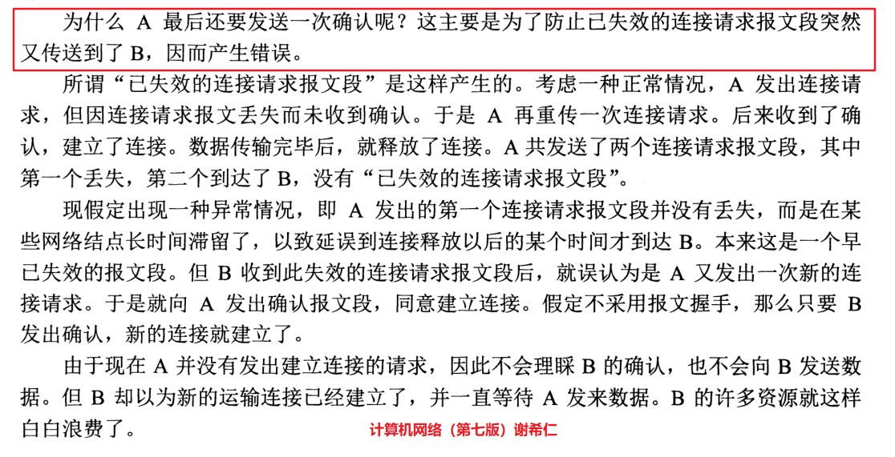
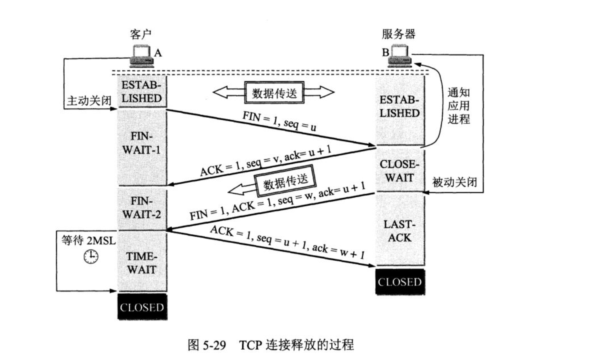

* [http](#http)
  * [http1.1 和 http2.0](#http1.1和http2.0)
  * [三次握手原因](#三次握手原因)
  * [四位挥手](#四位挥手)
  * [keep-alive](#keep-alive)
  * [在浏览器地址栏输入URL](#在浏览器地址栏输入URL)
* [进程和线程][#进程和线程]

## http
* [TCP链接为什么需要三次？关闭需要四次？（A 标示client，B表示server）](https://zhuanlan.zhihu.com/p/58603455)

  ### 三次握手原因
  
   * 三次握手不是TCP本身的要求, 而是为了满足"在不可靠信道上可靠地传输信息"这一需求所导致的
   * A最后一次还要发送一次确认的目的：是为了防止已失效的连接请求报文突然又传送到B，因而产生错位, 会导致很多资源浪费
   

  ### 四位挥手
  
    * 关闭连接时，当收到对方的FIN报文通知时，它仅仅表示对方没有数据发送给你了；但未必你所有的数据都全部发送给对方了，所以你可能未必会马上会关闭SOCKET,也即你可能还需要发送一些数据给对方之后，再发送FIN报文给对方来表示你同意现在可以关闭连接了

  * 为什么A在TIME-WAIT（A接受到B发生的FIN报文）状态必须等待2MSL的时间呢？
    1. 为了保证A发生的最后一个ACK报文能够到达B（A发送的ACK报文有可能丢失，如果B没有接受到，A会重新发送连接释放请求，为了处理这种情况）
    2. 防止“已经失效的连接请求报文段”出现在本链接中

### keep-alive

  * Keep-Alive：timeout  max （持久连接、连接重用）

    1. TCP连接更少，这样就会节约TCP连接在建立、释放过程中，主机和路由器上的CPU和内存开销
    2. 网络拥塞也减少了，拿到响应的延时也减少了

    #### 当保持长连接时，如何判断一次请求已经完成？

    1.Content-Length: 实体内容的长度(静态资源)

    2.Transfer-Encoding：传输编码，服务端无法知道实体内容的长度，可以通过指定Transfer-Encoding: chunked来告知浏览器当前的编码是将数据分成一块一块传递的。当浏览器接收到一个长度为0的chunked时， 知道当前请求内容已全部接收

  * TCP keep-alive: TCP的一种检测TCP连接状况的保鲜机制

    如何检测长时间没有数据报文传输对方还在线，是否需要连接保持？
    当超过一段时间之后，TCP自动发送一个数据为空的报文（侦测包）给对方，如果对方回应了这个报文，说明对方还在线，连接可以继续保持，如果对方没有报文返回，并且重试了多次之后则认为链接丢失，没有必要保持连接

### http1.1和http2.0
  * htt1.1:

    tcp连接持久化，Connection: keep-alive;

    浏览器客户端在同一时间，针对同一域名下的请求有一定数量的限制。超过限制数目的请求会被阻塞。(服务端会有连接限制)
  * http2.0:
    1. 二进制分帧
      * 帧都共享一个8字节的首部，其中包含帧的长度、类型、标志、还有一个保留位，并且至少有标识出当前帧所属的流的标识符
    2. 多路复用 （服务端需要设置 listen  443 ssl http2;）
      * 居于二进制分帧，共享TCP链接基础上同时发送请求和响应
      * 根据流标识符和首部将他们重新组装起来
    3. HTTP首部压缩（采用HPACK算法）
    4. 服务器推送

### 在浏览器地址栏输入URL
 1. 浏览器查看缓存，如果请求资源在缓存中并且新鲜，跳转到转码步骤
    1. 如果资源未缓存，发起新请求
    2. 如果已缓存，检验是否足够新鲜，足够新鲜直接提供给客户端，否则与服务器进行验证。
    3. 检验新鲜通常有两个HTTP头进行控制Expires和Cache-Control：
      * HTTP1.0提供Expires，值为一个绝对时间表示缓存新鲜日期
      * HTTP1.1增加了Cache-Control: max-age=,值为以秒为单位的最大新鲜时间

  2. 浏览器解析URL获取协议，主机，端口，path
  3. 浏览器组装一个HTTP（GET）请求报文
  4. 浏览器获取主机ip地址，过程如下：
    1. 浏览器缓存
    2. 本机缓存
    3. hosts文件
    4. 路由器缓存
    5. ISP DNS缓存
    6. DNS递归查询（可能存在负载均衡导致每次IP不一样）

  5. 打开一个socket与目标IP地址，端口建立TCP链接，三次握手如下：
    1. 客户端发送一个TCP的SYN=1，Seq=X的包到服务器端口
    2. 服务器发回SYN=1， ACK=X+1， Seq=Y的响应包
    3. 客户端发送ACK=Y+1， Seq=Z

  6. TCP链接建立后发送HTTP请求
  7. 服务器接受请求并解析，将请求转发到服务程序，如虚拟主机使用HTTP Host头部判断请求的服务程序
  8. 服务器检查HTTP请求头是否包含缓存验证信息如果验证缓存新鲜，返回304等对应状态码
  9. 处理程序读取完整请求并准备HTTP响应，可能需要查询数据库等操作
  10. 服务器将响应报文通过TCP连接发送回浏览器
  11. 浏览器接收HTTP响应，然后根据情况选择关闭TCP连接或者保留重用，关闭TCP连接的四次握手如下：
    1. 主动方发送Fin=1， Ack=Z， Seq= X报文
    2. 被动方发送ACK=X+1， Seq=Z报文
    3. 被动方发送Fin=1， ACK=X， Seq=Y报文
    4. 主动方发送ACK=Y， Seq=X报文

  12. 浏览器检查响应状态吗：是否为1XX，3XX， 4XX， 5XX，这些情况处理与2XX不同
  13. 如果资源可缓存，进行缓存
  14. 对响应进行解码（例如gzip压缩）
  15. 根据资源类型决定如何处理（假设资源为HTML文档）
  16. 解析HTML文档，构件DOM树，下载资源，构造CSSOM树，执行js脚本，这些操作没有严格的先后顺序，以下分别解释
  17. 构建DOM Tree：
    1. Tokenizing：根据HTML规范将字符流解析为标记
    2. Lexing：词法分析将标记转换为对象并定义属性和规则
    3. DOM construction：根据HTML标记关系将对象组成DOM树

  18. 解析过程中遇到图片、样式表、js文件，启动下载
  19. 构建CSSOM Tree：
    1. Tokenizing：字符流转换为标记流
    2. Node：根据标记创建节点
    3. CSSOM：节点创建CSSOM树

  20. 根据DOM树和CSSOM树构建渲染树 Rerder Tree:
    1. 从DOM树的根节点遍历所有可见节点，不可见节点包括：1）script,meta这样本身不可见的标签。2)被css隐藏的节点，如display: none
    2. 对每一个可见节点，找到恰当的CSSOM规则并应用
    3. 发布可视节点的内容和计算样式 （根据节点和样式计算确切的在浏览器的大小和位置）
  21. Layout Tree 
  22. Paint

  ### [进程和线程](http://www.ruanyifeng.com/blog/2013/04/processes_and_threads.html)
  * 共同点：都是一个时间段的描述，是CPU工作时间段的描述。
  * 区别：
    * 一个进程中会有多个线程
    * 任一时刻，CPU总是运行一个进程，其他进程处于非运行状态。单个CPU一次只能运行一个任务
    * 每个线程都可以使用共享内存
    * 一个线程使用某些共享内存时，其他线程必须等它结束，才能使用这一块内存